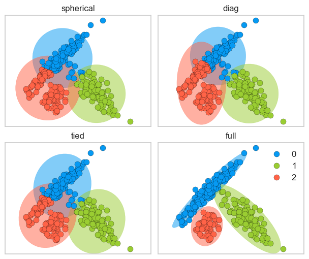

# Lecture 1: K-Means Clustering

## Unsupervised Learning Introduction

- Type of machine learning algorithm used to draw inferences from datasets consisting of input data **without labeled responses**

- Examples:
  - Clustering
  - Dimensionality Reduction

## K-Means Clustering

### Clustering Motivation

- Labeling data is expensive and time-consuming
- Clustering is a way to group based on similarity
  - Can get a sense of the structure of the data without labeled responses
- **Clustering**: Task of partitioning data into groups called clusters based on similarity
- Goal:
  - Points in the same cluster should be as similar as possible
  - Points in different clusters should be as different as possible
- Can have multiple different clusters in the same dataset
  - e.g. in dataset of food can have clusters of:
    - appetizers, main courses, desserts
    - cuisines
    - healthy vs unhealthy

---

**Comparisons with kNN**:
| k-Means | k-Nearest Neighbors |
| ------- | -------------------- |
| Unsupervised | Supervised |
| Clustering | Classification |
| Parametric | Non-parametric |
| k = number of clusters | k = number of neighbors |

---

#### Common Applications

1. Data Exploration
   - Summarize/ compress data
   - Partition data into groups
2. Customer Segmentation
   - Group customers based on purchasing behavior
   - Target marketing
3. Document Clustering
   - Group similar documents together
   - Topic modeling
     Other applications: Medical imaging, Anomaly detection, Image segmentation, Inputting missing data, data compression, etc.

### K-Means

- One of the most popular clustering algorithms
- Simple and easy to implement
- **Basic Algorithm**:
  1. Randomly initialize $K$ centroids
  2. Assign each data point to the nearest centroid
  3. Update the centroids to the mean of the data points assigned to it
  4. Repeat steps 2 and 3 until convergence
- **Properties**:
  - Will always converge (not necessarily to the right answer)
  - Sensitive to intialization
  - Terminates when centroids do not change
  - Makes _linear_ decision boundaries
  - **MUST SCALE DATA** before applying K-means
    - Because K-means uses distance
    - If features are on different scales, the clustering will be biased towards the features with larger scales

---

- **Input**:
  - $X$: Set of $n$ data points
  - $K$: Number of clusters
- **Output**:
  - $K$ clusters with centroids $\mu_1, \mu_2, \ldots, \mu_K$

```python
from sklearn.cluster import KMeans

kmeans = KMeans(n_clusters=3, n_init='auto')
kmeans.fit(X); # only need X

kmeans.labels_ # cluster assignments
kmeans.cluster_centers_ # cluster centroids
kmeans.predict(new_data) # predict cluster for new data
```

#### Choosing K

- K is a hyperparameter
  - As K increases -> smaller clusters
- No perfect way to choose K

1. **Elbow Method**:

   - $\text{Inertia} = \text{sum of intra-cluster distances}$
     - Sum of centroid to point distances of all points in the cluster of all clusters
   - Inertia decreases as K increases
   - Plot inertia vs K
     - Elbow point: point where inertia starts to decrease more slowly
   - Choose K at elbow point

   ```python
   from yellowbrick.cluster import KElbowVisualizer

    model = KMeans(n_init='auto')
    visualizer = KElbowVisualizer(model, k=(1, 10))

    visualizer.fit(XX)  # Fit the data to the visualizer
    visualizer.show();
   ```

2. **Silhouette Score**:
   $$\text{Silhouette Score} = \frac{b - a}{\max(a, b)}$$

   - $a$: Mean distance between a sample and all other points in the same cluster
   - $b$: Mean distance between a sample and all other points in the next nearest cluster
   - Range: $[-1, 1]$
     - 1: Object is well matched to its own cluster and poorly matched to neighboring clusters
     - 0: Object is not matched to its own cluster and might be better in neighboring clusters
     - -1: Object is poorly matched to its own cluster and well matched to neighboring clusters

   ```python
   from yellowbrick.cluster import SilhouetteVisualizer

   model = KMeans(2, n_init='auto', random_state=42)
   visualizer = SilhouetteVisualizer(model, colors="yellowbrick")
   visualizer.fit(XX)  # Fit the data to the visualizer
   visualizer.show();
   ```

## Gaussian Mixture Models (High-Level Overview)

- Motivation:
  - K-means assumes spherical clusters
  - GMMs can have more flexible cluster shapes



```python
from sklearn.mixture import GaussianMixture

gmm = GaussianMixture(n_components=3, covariance_type='full')

gmm.fit(X_train)
gmm_labels = gmm.predict(X_train)

# Get values
gmm.means_ # cluster means (size: K x n_features)
gmm.covariances_ # cluster covariances (size: K x n_features x n_features)
gmm.weights_ # cluster weights (size: K)
```

- `covariance_type`:
  - `full`: Each component has its own general covariance matrix
    - size: $K \times n\_features \times n\_features$
  - `tied`: All components share the same general covariance matrix
    - size: $n\_features \times n\_features$
  - `diag`: Each component has its own diagonal covariance matrix
    - size: $K \times n\_features$
  - `spherical`: Each component has its own single variance
    - size: $K$

### How GMMs Work

$$P(x) = \sum_{k=1}^{K} \pi_k \mathcal{N}(x | \mu_k, \Sigma_k)$$

- $P(x)$: Probability of observing $x$
- $\pi_k$: Weight of the $k$th Gaussian (between 0 and 1)
- $k$: Number of clusters
- $\mathcal{N}(x | \mu_k, \Sigma_k)$: Gaussian distribution with mean $\mu_k$ and covariance $\Sigma_k$

  <br/>

- **Generative Model**: models the probability of a data point being generated from the mixture of Gaussians
- The generative story of the model assumes that each data point in the dataset is generated from one of the Gaussian components
  - Choose $k$ with probability $\pi_k$
  - Generate data point from $\mathcal{N}(x | \mu_k, \Sigma_k)$
- **High Level Algorithm**:
  1. Initialize $\pi_k, \mu_k, \Sigma_k$
  2. E-step: Compute the probability of each data point belonging to each cluster
  3. M-step: Update $\pi_k, \mu_k, \Sigma_k$ to maximize the likelihood of the data
  4. Repeat steps 2 and 3 until convergence
- Under the hood, GMMs use the Expectation-Maximization (EM) algorithm.
  - Basic idea: treat cluster assignments as hidden variables and iteratively update them

### GMM Properties

- Sensitivity to initialization
- Non-convex optimization problem
  - Can have multiple local optima
