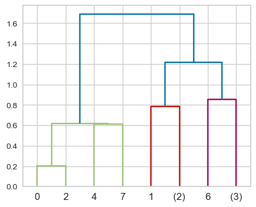
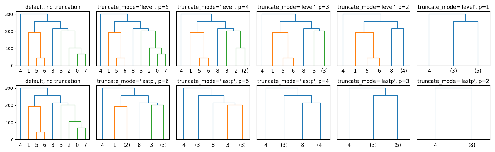

# Lecture 2: DBSCAN and Hierarchical Clustering

## DBSCAN

- Density-Based Spatial Clustering of Applications with Noise
- **Idea**: Clusters are dense regions in the data space, separated by low-density regions
- Addresses K-Means' weaknesses:
  - No need to specify number of clusters
  - Can find clusters of arbitrary shapes
  - Can identify points that don't belong to any cluster (points don't have to belong to any cluster, label = `-1`)
  - Initialization is not a problem
- Comparison to K-means:
  - does not have to assign all points to clusters
  - no `predict` method unlike K-means
  - non-parametric

| Pros                                  | Cons                                          |
| ------------------------------------- | --------------------------------------------- |
| Can find clusters of arbitrary shapes | cannot predict new data                       |
| Can detect outliers                   | Needs tuning of 2 non-trivial hyperparameters |

- **DBSCAN Failure Cases**:
  - Different densities of clusters

```python
from sklearn.cluster import DBSCAN

dbscan = DBSCAN(eps=0.5, min_samples=5)
dbscan.fit(X)

dbscan.labels_
```

- `eps` (default=0.5): maximum distance between two samples for one to be considered as in the neighborhood of the other.
- `min_samples` (default = 5): number of samples in a neighborhood for a point to be considered as a core point

### How DBSCAN works

- **Kinds of points**:

  - **Core point**: A point that has at least `min_samples` points within `eps` of it
  - **Border point**: A point that is within `eps` of a core point, but has less than `min_samples` points within `eps` of it
  - **Noise point**: A point that is neither a core point nor a border point

- **Algorithm**:
  - randomly pick a point that has not been visited
  - Check if it's a core point
    - See `eps` distance around the point if there are `min_samples` points
  - If yes, start a cluster around this point
  - Check if neighbors are core points and repeat
  - Once no more core points, pick another random point and repeat

### Evaluating DBSCAN Clusters

1. Silhouette Method
   - Cannot use elbow method because no centroids

```python
from yellowbrick.cluster import SilhouetteVisualizer

model = DBSCAN(eps=0.5, min_samples=5)
model.fit(X)

# Silhoutte is designed for k-means, so we need to do this
n_clusters = len(set(model.labels_))
dbscan.n_clusters = n_clusters
dbscan.predict = lambda x: model.labels_

visualizer = SilhouetteVisualizer(dbscan, colors='yellowbrick')
visualizer.fit(X)
visualizer.show()
```

## Hierarchical Clustering

- Hard to decide how many clusters
  - So get complete picture of similarity between points then decide
- **Main idea**:
  - Start with each point as a cluster
  - Merge the closest clusters
  - Repeat until only a single cluster remains (n-1 steps)
- Visualized as a `dendrogram`

```python
from matplotlib import pyplot as plt
from scipy.preprocessing import StandardScaler
from scipy.cluster.hierarchy import dendrogram, ward

X_scaled = StandardScaler().fit_transform(X)

linkage_array = ward(X_scaled) # see below for linkage criteria

# Plot the dendrogram
ax = plt.subplot()
dendrogram(linkage_array, ax=ax, color_threshold=3)
```

### Dendrogram



- **x-axis**: data points
- **y-axis**: distance between clusters
- Is a tree like plot
  - New parent node for each 2 clusters that are merged
- Length of the vertical line at the point of merging is the distance between the clusters

### Linkage Criteria

- Linkage Criteria determines how to find similarity between clusters
- **Single Linkage**:
  - Merge smallest **min** distance between points in two clusters
  - Can lead to chaining
  - `scipy.cluster.hierarchy.single`
- **Complete Linkage**:
  - Merge smallest **max** distance between points in two clusters
  - Can lead to crowding (tight clusters)
  - `scipy.cluster.hierarchy.complete`
- **Average Linkage**:
  - Merge smallest **mean** distance between points in two clusters
  - `scipy.cluster.hierarchy.average`
- **Ward's Method**:
  - Minimizes the variance of the clusters being merged
  - Leads to equally sized clusters
  - `scipy.cluster.hierarchy.ward`

### Simplifying the Dendrogram

1. **Truncation**:

   - `scipy.cluster.hierarchy.dendrogram` has a `truncate_mode` parameter
   - Two levels:

     - `lastp`: show last p merged clusters (only p nodes are shown)
     - `level`: level is all nodes with `p` merges from the root



2. **Flatten**
   - Directly cut the dendogram at certain condition (e.g. distance or max number of clusters)

```python
from scipy.cluster.hierarchy import fcluster

# 3 is the max distance
hier_labels = fcluster(linkage_array, 3 , criterion='distance')

# Based on max number of clusters (4 max clusters)
hier_labels = fcluster(linkage_array, 4 , criterion='maxclust')
```
