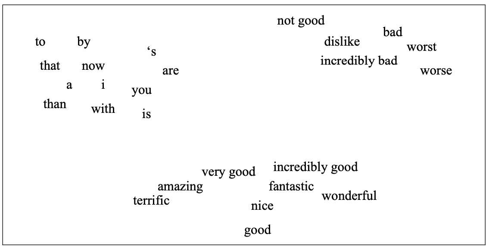
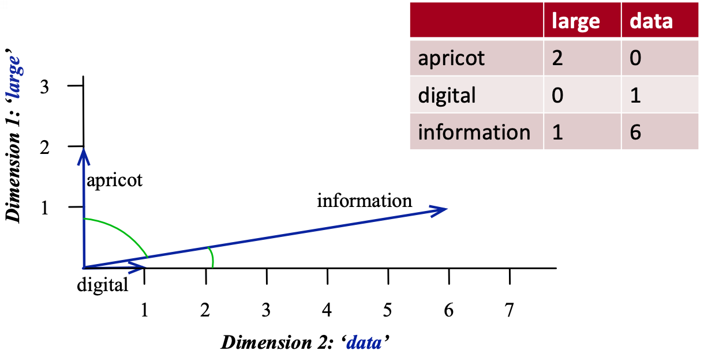
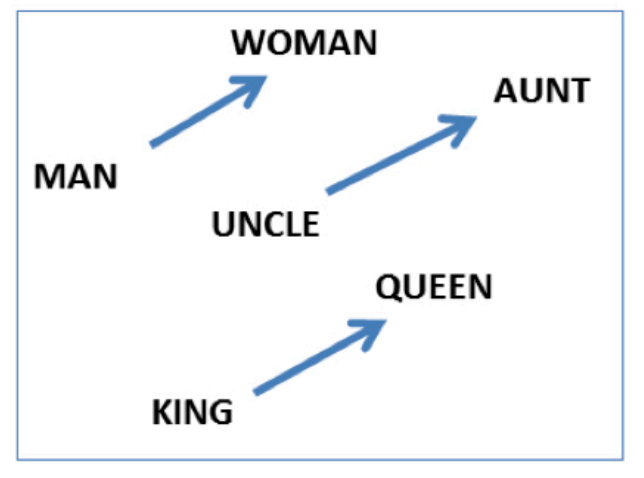

# Lecture 5: Word Embeddings, word2vec

## Word Embeddings

- **Motivation**: You can understand a word by the context/company it keeps.

### Introduction

- Standard approach: put words in vector space and the distance between words is the similarity between them.

- `word2vec` is unsupervised/ semi-supervised learning because:
  - closely related to dimensionality reduction + extracting meaninggful representation from raw data
  - do not need any labeled data
  - running text is used as supervision signal

### Word Representation

- **One-hot representation**:
  - Simplest way to represent a word
  - OHE vector is a vector of all 0s except for a 1 at the index of the word in the vocabulary
  - **Disadvantages**:
    - High dimensionality
    - No notion of similarity between words
    - No notion of context
- **Term-term co-occurrence matrix**:
  - A matrix where each row and column corresponds to a word in the vocabulary
  - The value in the i-th row and j-th column is the number of times word i and word j appear together in a context window
    - **Context window**: a fixed-size window that slides over the text (e.g. window size = 2 means 2 words to the left and 2 words to the right)
  - **Disadvantages**:
    - High dimensionality
    - Sparse
    - Does not capture polysemy (multiple meanings of a word)

#### Dense Word Representations

- Term-term co-occurrence matrix is sparse and high-dimensional
- Better to learn short and dense vectors for words
  - Easier to store and train
  - Better generalization

#### Word2Vec

- Create dense word embeddings using neural networks
- **Idea**: Predict the context of a word given the word itself
  - **Skip-gram**: Predict the context words given the target word
  - **Continuous Bag of Words (CBOW)**: Predict the target word given the context words
- Two moderately efficient training algorithms:
  - **Hierarchical softmax**: Use a binary tree to represent all words in the vocabulary
  - **Negative sampling**: Treat the problem as a binary classification problem

##### Skip-gram

- Predict the context words given the target word
- NN to obtain short and dense word vectors
- **Architecture**:

  - **Input layer**: one-hot encoded vector of the target word (size = $V \times 1$)

    > $W$ = input layer to hidden layer weights (size = $V \times d$)
    > $\text{hidden} = W^T \times \text{input}$

  - **Hidden layer**: linear transformation (no activation function) to obtain the word vector (size = $d \times 1$)

    > $W_c$ = hidden layer to output layer weights (size = $V \times d$)
    > $\text{output} = W_c \times \text{hidden}$

  - **Output layer**: softmax layer to predict the context words (size = $V \times 1$)
    - Returns a one-hot encoded vector of the context word

- The dense representation of the word:
  - $W$: word embedding matrix (size = $V \times d$)
  - $W_c$: shared context embedding matrix (size = $V \times d$)
- Train multiple target+context pairs until the weights converge
   
- **Example**:
  - "Add freshly _squeezed_ [pineapple] _juice_ to your smoothie.
    - Target word: pineapple
    - NN outputs probability distribution of context words: {squeezed, juice}

###### Objective Function

$$\arg \max\limits_\theta \prod\limits_{(w_c,w_t) \in D} P(w_c|w_t;\theta) \approx \prod\limits_{(w_c,w_t) \in D} \frac{e^{w_c.w_t}}{\sum\limits_{\substack{c' \in V}} e^{w_{c'}.w_t}}$$

- $w_t$ &rarr; target word
- $w_c$ &rarr; context word
- $D$ &rarr; the set of all target and context pairs from the text
- $P(w_c|w_t;\theta)$ &rarr; probability of context word given the target word
- **Assumption**: maximizing this objective would lead to good word embeddings

###### Hyperparameters

- Dimensionality of word vectors ($d$)
- Window size:
  - Small window size: captures more syntactic information (e.g. verb-noun relationships)
  - Large window size: captures more semantic information (e.g. country-capital relationships)

#### Pre-trained Word Embeddings

- [word2vec](https://code.google.com/archive/p/word2vec/)
- [wikipedia2vec](https://wikipedia2vec.github.io/wikipedia2vec/pretrained/)
- [GloVe](https://nlp.stanford.edu/projects/glove/)
- [fastText pre-trained embeddings for 294 languages](https://fasttext.cc/docs/en/pretrained-vectors.html)

#### Success of word2vec

- Can do analogy tasks
  - e.g. man to king as women to (queen)
  - **MAN : KING :: WOMAN : ?**
  - solce by: $\vec{X} = \vec{\text{KING}} − \vec{\text{MAN}} + \vec{\text{WOMAN}}$

