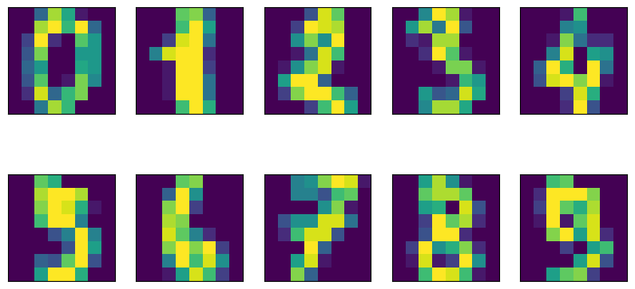
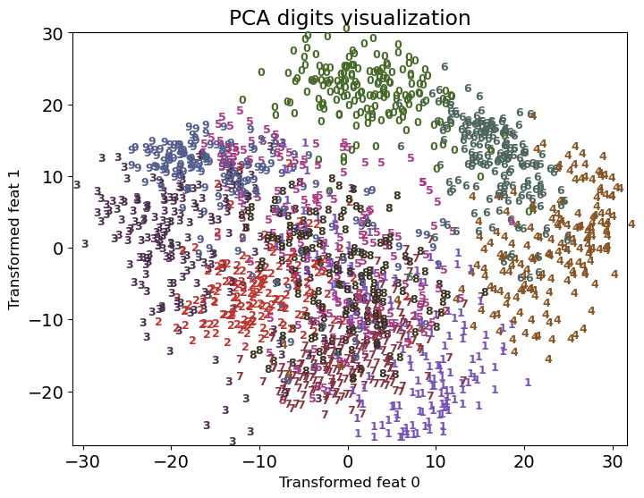
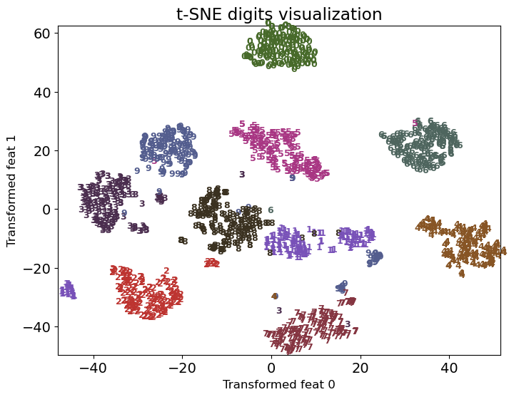
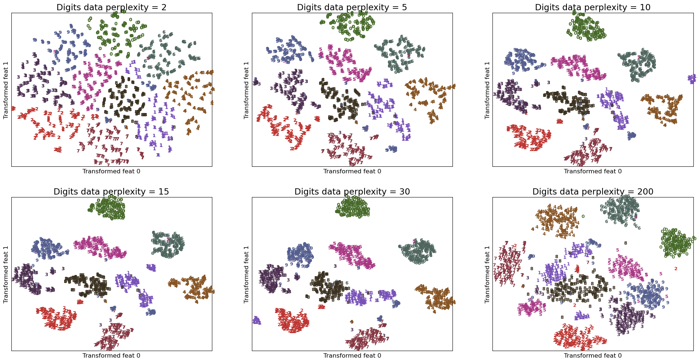

# Lecture 6: Word Embeddings, Manifold Learning

## Word Embedding Applications

- Using word embeddings for various ML (NLP) tasks
- Before using it for application, need to **evaluate quality** of word embeddings:
  - Examine a number of word pairs for similarity scores (use TOEFL MCQ dataset)
  - Examine different analogies for stereotypes and biases they encode
  - Visualize embeddings in two dimensions

### Document Similarity and Text Classification

- **Motivation**: You can understand a document by the context/company it keeps.
- Assuming we have reasonable representations of words, we can represent a paragraph/ document as:
  1. Average embeddings
  2. Concatenate embeddings

#### Averaging Embeddings

- Do it with `spacy`
- We do not necessarily get expected representation of text
  - e.g. "Machine Learning" and "Learning Machine" will have same representation
- For long sentences or documents, this can get very noisy (mix of different signals)

```python
import spacy
nlp = spacy.load('en_core_web_md')

nlp("empty").vector[0:10] # access word vector

doc = nlp("I like apples and oranges")
doc_vec = doc.vector # shape (300,)

doc2 = nlp("I like bananas and grapes")
doc.similarity(doc2) # check similarity by averaging word vectors
```

#### Concatenating Embeddings

- `spacy`'s `mlp.pipe()` takes iterable of texts and returns an iterable of `Doc` objects.

```python
X_train_embeddings = pd.DataFrame([text.vector for text in nlp.pipe(X_train)]) # shape (n, 300)
X_test_embeddings = pd.DataFrame([text.vector for text in nlp.pipe(X_test)])

lgr = LogisticRegression(max_iter=1000) # from sklearn.linear_model
lgr.fit(X_train_embeddings, y_train)
```

- spaCy uses corpus of text styles from telephone conversations, newswire, newsgroups, broadcast news, weblogs, and conversational telephone speech.
- Might need to train your own for medical, tweets, etc.

### word2vec for Product Recommendations

- Not so common, but it's possible
- Comparisons:
  - Words -> Products
  - Sentences -> Purchase history of users
  - Vocabulary -> Products

## Manifold Learning


[source](https://www.cs.ubc.ca/~schmidtm/Courses/340-F19/L31.pdf)

- **Manifold**: Lower-dimensional structure embedded within a higher-dimensional space (can be curved/ twisted)
- **Manifold Learning**: Techniques to learn the structure of the manifold from the data
  - Based on the idea of finding low dimensional representation that **preserves the distances between points** as best as possible
  - Real-world data often lies on a low-dimensional manifold
- Common methods:
  - [Multi-dimensional scaling (MDS)](https://scikit-learn.org/stable/modules/generated/sklearn.manifold.MDS.html)
  - [ISOMAP](https://scikit-learn.org/stable/modules/generated/sklearn.manifold.Isomap.html#sklearn.manifold.Isomap)
  - [Locally linear embedding (LLE)](https://scikit-learn.org/stable/modules/generated/sklearn.manifold.LocallyLinearEmbedding.html)
  - [t-SNE](https://scikit-learn.org/stable/modules/generated/sklearn.manifold.TSNE.html)
  - [UMAP [best one]](https://umap-learn.readthedocs.io/en/latest/)

### t-SNE (t-distributed Stochastic Neighbor Embedding)

- t-SNE applies **non-linear** transformation to the data
  - PCA is a linear dimensionality reduction technique
- Mostly used for visualization
- Does not construct an explicit mapping function from the high-dimensional space to the low-dimensional space
  - It **optimizes the position of the points in the low-dimensional space**
- Hyperparameters:
  - `perplexity`: Number of nearest neighbors to consider
  - `learning_rate`: Step size for gradient descent
  - `n_iter`: Number of iterations
- **Cons**:
  - slow and does not scale well to large datasets
  - random initialization can lead to different results
  - sensitive to hyperparameters (perplexity)
  - Need to re-run when new data is added

#### Example with `scikit-learn`

```python
from sklearn.manifold import TSNE
from sklearn.datasets import load_digits

digits = load_digits()

tsne = TSNE(n_components=2, random_state=42)
digits_tsne = tsne.fit_transform(digits.data)
```

- Input:
  

- PCA output:
  

- t-SNE output:
  

#### High-level Algorithm

- Idea: Preserve the similarity between points in high-dimensional space in the low-dimensional space

**In high-dimensional space,**

1. Compute pairwise similarity between points as probabilities
2. Similarity b/w $x_i$ and $x_j$ is $p_{ij}$
   - $p_{ij}$ is calculated using Gaussian distribution, centered at $x_i$
     - It is the density of $x_j$ under the Gaussian centered at $x_i$
     - $p_{ij}$ high if $x_i$ and $x_j$ are close to each other (and low if far)
   - Variance $\sigma^2$ of the Gaussian is influenced by `perplexity` hyperparameter
     - `perplexity` is a measure of effective number of neighbors to consider
     - Higher perplexity, larger variance, more neighbors

**In low-dimensional space,**

1. Randomly initialize points in low-dimensional space (e.g. PCA)
2. Calculates a similar set of pairwise probabilities $q_{ij}$ in the low-dimensional space
   - $q_{ij}$ is calculated using **t-distribution** (NOT Gaussian) to mitigate crowding problem
     - Makes sure points are not crowded together
   - t-distribution has heavier tails than Gaussian
     - Assigns a higher probability to points that are far apart

**Loss function**

- Minimize the difference between $p_{ij}$ and $q_{ij}$ using gradient descent (use Kullback-Leibler divergence)

$$KL(P||Q) = \sum_{i,j}p_{ij}\log\left(\frac{p_{ij}}{q_{ij}}\right)$$

#### Hyperparameter: Perplexity

- Perplexity is a measure of effective number of neighbors to consider

  - Low: consider fewer neighbors, smaller variance
  - High: consider more neighbors, larger variance

  
