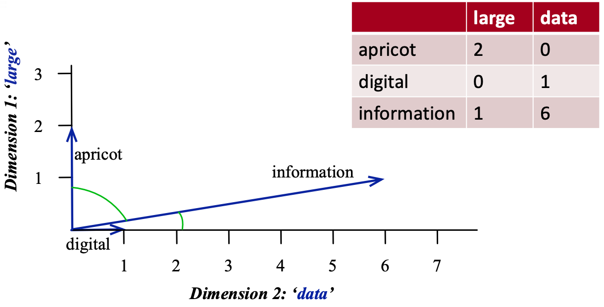
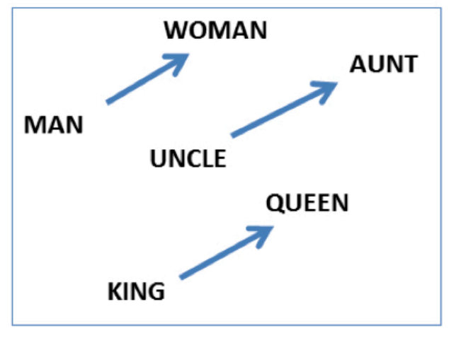

# Quiz 2 - 563

## Word Embeddings

- **Motivation**: You can understand a word by the context/company it keeps.

### Introduction

- Standard approach: put words in vector space and the distance between words is the similarity between them.
- `word2vec` is unsupervised/ semi-supervised learning because:
  - closely related to dimensionality reduction + extracting meaninggful representation from raw data
  - do not need any labeled data
  - running text is used as supervision signal

### Word Representation

- **One-hot representation**:
  - Simplest way to represent a word
  - OHE vector is a vector of all 0s except for a 1 at the index of the word in the vocabulary
    - rows = words in sentence, columns = words in vocabulary
  - **Disadvantages**:
    - High dimensionality
    - No notion of similarity between words (dot product = 0)
    - No notion of context
- **Term-term co-occurrence matrix**:
  - A matrix where each row and column corresponds to a word in the vocabulary
  - The value in the i-th row and j-th column is the number of times word i and word j appear together in a context window
    - **Context window**: a fixed-size window that slides over the text (e.g. window size = 2 means 2 words to the left and 2 words to the right)
  - **Disadvantages**:
    - High dimensionality
    - Sparse
    - Does not capture polysemy (multiple meanings of a word)



#### Dense Word Representations

- Term-term co-occurrence matrix is sparse and high-dimensional
- Better to learn short and dense vectors for words
  - Easier to store and train
  - Better generalization
- Approaches:
  - **Latent Semantic Analysis (LSA)**: Use SVD to reduce the dimensionality of the term-term co-occurrence matrix
    - Works better for small datasets compared to word2vec
  - **Word2Vec**: Use neural networks to learn word embeddings

#### Word2Vec

- Create **short and dense** word embeddings using neural networks
- **Idea**: Predict the context of a word given the word itself
  - **Skip-gram**: Predict the context words given the target word
  - **Continuous Bag of Words (CBOW)**: Predict the target word given the context words
- Two moderately efficient training algorithms:
  - **Hierarchical softmax**: Use a binary tree to represent all words in the vocabulary
  - **Negative sampling**: Treat the problem as a binary classification problem

##### word2vec: Skip-gram

- Predict the context words given the target word
- NN to obtain short and dense word vectors
- **Architecture**:


- **Input layer**: one-hot encoded vector of the target word (size = $V \times 1$)

  > $W$ = input layer to hidden layer weights (size = $V \times d$)
  > $\text{hidden} = W^T \times \text{input}$

- **Hidden layer**: linear transformation (no activation function) to obtain the word vector (size = $d \times 1$)

  > $W_c$ = hidden layer to output layer weights (size = $V \times d$)
  > $\text{output} = W_c \times \text{hidden}$

- **Output layer**: softmax layer to predict the context words (size = $V \times 1$)

  - Returns a one-hot encoded vector of the context word

- The dense representation of the word:
  - $W$: **word embedding matrix** (size = $V \times d$)
    - This is the main output of the algorithm
  - $W_c$: shared context embedding matrix (size = $V \times d$)
- Train multiple target+context pairs until the weights converge
  </br>
- **Example**:
  - "Add freshly _squeezed_ [pineapple] _juice_ to your smoothie.
    - Target word: pineapple
    - NN outputs probability distribution of context words: {squeezed, juice}

###### Skip-Gram Objective Function

$$\arg \max\limits_\theta \prod\limits_{(w_c,w_t) \in D} P(w_c|w_t;\theta) \approx \prod\limits_{(w_c,w_t) \in D} \frac{e^{w_c.w_t}}{\sum\limits_{\substack{c' \in V}} e^{w_{c'}.w_t}}$$

- **Want to get the context word with the highest probability given the target word**
- $w_t$ &rarr; target word
- $w_c$ &rarr; context word
- $D$ &rarr; the set of all target and context pairs from the text
- $P(w_c|w_t;\theta)$ &rarr; probability of context word given the target word
- **Assumption**: maximizing this objective would lead to good word embeddings

###### Hyperparameters

- Dimensionality of word vectors ($d$)
- Window size:
  - Small window size: captures more syntactic information (e.g. verb-noun relationships)
  - Large window size: captures more semantic information (e.g. country-capital relationships)

#### Pre-trained Word Embeddings

- [word2vec](https://code.google.com/archive/p/word2vec/)
- [wikipedia2vec](https://wikipedia2vec.github.io/wikipedia2vec/pretrained/): for 12 languages
- [GloVe](https://nlp.stanford.edu/projects/glove/): based on GloVe algorithm (Stanford)
- [fastText pre-trained embeddings for 294 languages](https://fasttext.cc/docs/en/pretrained-vectors.html)

#### Success of word2vec

- Can do analogy tasks

  - e.g. man to king as women to (queen)
  - **MAN : KING :: WOMAN : ?**
  - solce by: $\vec{X} = \vec{\text{KING}} − \vec{\text{MAN}} + \vec{\text{WOMAN}}$

- There are some biases in the word embeddings because they are trained on biased data



### Other Word Embeddings

#### FastText

- NLP library by Facebook research
- Includes an algorithm which is an extension to word2vec
- Helps deal with unknown words elegantly
- Breaks words into several n-gram subwords
- Example: trigram sub-words for berry are ber, err, rry
  - Embedding(berry) = embedding(ber) + embedding(err) + embedding(rry)

#### gloVe (Global Vectors for Word Representation)

- Starts with the co-occurrence matrix
  - Co-occurrence can be interpreted as an indicator of semantic proximity of words
- Takes advantage of global count statistics
- Predicts co-occurrence ratios
- Loss based on word frequency

## Word Embedding Applications

- Using word embeddings for various ML (NLP) tasks
- Before using it for application, need to **evaluate quality** of word embeddings:
  - Examine a number of word pairs for similarity scores (use TOEFL MCQ dataset)
  - Examine different analogies for stereotypes and biases they encode
  - Visualize embeddings in two dimensions

### Document Similarity and Text Classification

- **Motivation**: You can understand a document by the context/company it keeps.
- Assuming we have reasonable representations of words, we can represent a paragraph/ document as:
  1. Average embeddings
  2. Concatenate embeddings

#### Averaging Embeddings

- Do it with `spacy`
- We do not necessarily get expected representation of text
  - e.g. "Machine Learning" and "Learning Machine" will have same representation
- For long sentences or documents, this can get very noisy (mix of different signals)

#### Concatenating Embeddings

- `spacy`'s `mlp.pipe()` takes iterable of texts and returns an iterable of `Doc` objects.
- spaCy uses corpus of text styles from telephone conversations, newswire, newsgroups, broadcast news, weblogs, and conversational telephone speech.
- Might need to train your own for medical, tweets, etc.

### word2vec for Product Recommendations

- Not so common, but it's possible
- Comparisons:
  - Words -> Products
  - Sentences -> Purchase history of users
  - Vocabulary -> Products

## Manifold Learning


[source](https://www.cs.ubc.ca/~schmidtm/Courses/340-F19/L31.pdf)

- **Manifold**: Lower-dimensional structure embedded within a higher-dimensional space (can be curved/ twisted)
- **Manifold Learning**: Techniques to learn the structure of the manifold from the data
  - Based on the idea of finding low dimensional representation that **preserves the distances between points** as best as possible
  - Real-world data often lies on a low-dimensional manifold
- Common methods:
  - [Multi-dimensional scaling (MDS)](https://scikit-learn.org/stable/modules/generated/sklearn.manifold.MDS.html)
  - [ISOMAP](https://scikit-learn.org/stable/modules/generated/sklearn.manifold.Isomap.html#sklearn.manifold.Isomap)
  - [Locally linear embedding (LLE)](https://scikit-learn.org/stable/modules/generated/sklearn.manifold.LocallyLinearEmbedding.html)
  - [t-SNE](https://scikit-learn.org/stable/modules/generated/sklearn.manifold.TSNE.html)
  - [UMAP [best one]](https://umap-learn.readthedocs.io/en/latest/)

### t-SNE (t-distributed Stochastic Neighbor Embedding)

- t-SNE applies **non-linear** transformation to the data
  - PCA is a linear dimensionality reduction technique
- Mostly used for visualization
- Does not construct an explicit mapping function from the high-dimensional space to the low-dimensional space
  - It **optimizes the position of the points in the low-dimensional space**
- Hyperparameters:
  - `perplexity`: Number of nearest neighbors to consider
  - `learning_rate`: Step size for gradient descent
  - `n_iter`: Number of iterations
- **Cons**:
  - slow and does not scale well to large datasets
  - random initialization can lead to different results
  - sensitive to hyperparameters (perplexity)
  - Need to re-run when new data is added

#### Example with `scikit-learn`

#### High-level Algorithm

- Idea: Preserve the similarity between points in high-dimensional space in the low-dimensional space

**In high-dimensional space,**

1. Compute pairwise similarity between points as probabilities
2. Similarity b/w $x_i$ and $x_j$ is $p_{ij}$
   - $p_{ij}$ is calculated using Gaussian distribution, centered at $x_i$
     - It is the density of $x_j$ under the Gaussian centered at $x_i$
     - $p_{ij}$ high if $x_i$ and $x_j$ are close to each other (and low if far)
   - Variance $\sigma^2$ of the Gaussian is influenced by `perplexity` hyperparameter
     - `perplexity` is a measure of effective number of neighbors to consider
     - Higher perplexity, larger variance, more neighbors

**In low-dimensional space,**

1. Randomly initialize points in low-dimensional space (e.g. PCA)
2. Calculates a similar set of pairwise probabilities $q_{ij}$ in the low-dimensional space
   - $q_{ij}$ is calculated using **t-distribution** (NOT Gaussian) to mitigate crowding problem
     - Makes sure points are not crowded together
   - t-distribution has heavier tails than Gaussian
     - Assigns a higher probability to points that are far apart

**Loss function**

- Minimize the difference between $p_{ij}$ and $q_{ij}$ using gradient descent (use Kullback-Leibler divergence)

$$KL(P||Q) = \sum_{i,j}p_{ij}\log\left(\frac{p_{ij}}{q_{ij}}\right)$$

#### Hyperparamter: Perplexity

- Perplexity is a measure of effective number of neighbors to consider

  - Low: consider fewer neighbors, smaller variance
  - High: consider more neighbors, larger variance

## Recommender Systems Introduction

- A recommender suggests a particular product or service to users they are likely to consume.
- **Why is it important?**
  - Everything we buy or consume is influenced by this (music, shopping, movies, etc.)
  - It is the core of success for many companies (e.g. spotify, amazon, netflix, etc.)
  - Tool **to reduce the effort of users** to find what they want
- **Ethical considerations**:
  - Can lead to **filter bubbles** (e.g. political views, etc.)
  - Can lead to **privacy issues** (e.g. tracking user behavior)

### Data and Approaches to Recommender Systems

- **Data**:
  - purchase history
  - user-system interactions (e.g. clicks, likes, etc.)
  - features of the items (e.g. genre, price, etc.)
- **Approaches**:
  - **Collaborative filtering**:
    - Unsupervised learning
    - Have labels $y_{ij}$ (ratings for user $i$ and item $j$)
    - Learn latent features of users and items
  - **Content-based filtering**:
    - Supervised learning
    - Extract features of items/ users to predict ratings
  - **Hybrid methods**:
    - Combine both approaches

## Recommender Systems Structure

### Utility Matrix

- Also referred to as the **$Y$ matrix**
- Not actually used in real life because it will be very large (also sparse)
- Train and validation will have same number of rows (users) and columns (items)
  - $N$ users and $M$ items
  - $Y_{ij}$ is the rating of user $i$ for item $j$


- **predict rating $\neq$ regression or classification**:
  - It is a different problem because we don't have a target variable
  - We have to predict the missing values in the utility matrix

#### Creating a Utility Matrix

- Map to get user/item id -> indices (utility matrix)
- Inverse map to get indices -> user/item id

### Evaluation

- No notion of "accurate" recommendations, but still need to evaluate
- Unsupervised learning but <u>split the data and evaluate </u>
  - **SPLIT TRAIN /VALID ON RATINGS, NOT UTILITY MATRIX**
  - Utility matrix of train and validation will be **the same**
  - Code shown below, not really going to use `y`

```python
X_train, X_valid, y_train, y_valid = train_test_split(
    X, y, test_size=0.2, random_state=42
)
```

- **RMSE**:
  - It is the most common metric
  - It compares the predicted ratings with the actual ratings

### Baseline Approaches

- **Global Average**:
  - Predict everything as the global average rating
  - It is a very simple model
- **Per-User Average**:
  - Predict everything as the average rating of the user
- **Per-Item Average**:
  - Predict everything as the average rating of the item
- **Per-User and Per-Item Average**:
  - Predict everything as the average of the user and the item
- **KNN**:

  - Calculate distance between examples usign features where neither value is missing

#### Other possible approaches

1. **Clustering**:
   - Cluster the items, then recommend items from the same cluster
2. **Graphs and BFS**:
   - Create a graph of users and items
   - Use BFS to recommend items

## Collaborative Filtering

- Unsupervised learning
- **Intuition**:
  - People who agreed in the past are likely to agree again in future
  - Leverage social information for recommendations
- **PCA ?**:
  - To learn latent features of users and items
  - Run on utility matrix
  - **Problem**: missing values
    - PCA loss function $f(Z,W) = \sum_{i,j} ||W^TZ_{ij} - Y_{ij}||^2$
    - Cannot use SVD directly because have many missing values AND missing values make SVD undefined
  - **Solutions**:
    - Impute the values to do PCA
      - BUT, will introduce bias (distort the data)
      - Result will be dominated by the imputed values
    - Summing over only available values
      - Prone to overfitting
    - **Collaborative Filtering Loss Function**:
      - Only consider the available values
      - Add L2-reg to the loss function for W and Z
      - $f(Z,W) = \sum_{i,j} ||W^TZ_{ij} - Y_{ij}||^2 + \frac{\lambda_1}{2}||W||^2 + \frac{\lambda_2}{2}||Z||^2$
      - This accounts for the missing values and the regularization terms prevent overfitting (representations are not too complex)
      - This improved the RMSE score bby 7% in the Netflix competition
      - Optimize using SGD (stoachastic gradient descent) and WALS (weighted alternating least squares)
- **Other Notes**:
  - Result can be outside the range of the ratings
  - Will have problems with cold start (new users or items)
- Use `surprise` library for collaborative filtering

### Z and W in Collaborative Filtering


- $Z$ is no longer the points in the new hyperplane and $W$ is no longer the weights
- **$Z$**: [row = user] Maps users to latent feature of items
  - e.g. left for animation, right for documentaries
- **$W$**: [col = item] Maps items to latent feature of users
  - e.g. top for animation lovers, bottom for documentary lovers

## Distance Metrics


- **Cosine**:
  - $d(x,y) = \frac{x \cdot y}{||x|| \cdot ||y||}$
  - Collinear = 1, orthogonal = 0 (want a value close to 1)
  - It is the angle between the two vectors
  - Rank (high to low): C, A, B
- **Euclidean**:
  - $d(x,y) = ||x-y|| = \sqrt{\sum_{i=1}^n (x_i - y_i)^2}$
  - It is the straight line distance between the two points (want smaller distance)
  - Rank (low to high): B, C, A
- **Dot Product**:
  - $d(x,y) = x \cdot y$
  - It is the projection of one vector onto the other
  - If vectors are normalized, it is the same as cosine similarity (want larger value)
  - Rank (high to low): A, B, C
